# 아수라장 (mayhem)

Paper 기반 마인크래프트 PvP 미니게임 플러그인입니다.  
랜덤 바이옴 전장에서 팀전 또는 개인전으로 싸웁니다.

---

## 요구 사항

| 항목 | 버전 |
|------|------|
| Minecraft | 26.1.2 |
| Paper | 26.1.2+ |
| Java | 25+ |

## 게임 흐름

1. `/mayhem start` → GUI에서 **팀전 / 개인전**과 **기지 모드 / 야생 모드** 선택
2. 랜덤 바이옴 전장 추첨 후 카운트다운
3. 좁은 전장에서 30분간 전투 (시간은 항상 아침, 날씨는 항상 맑음)
4. 시간 종료 또는 `/mayhem stop` 시 게임 끝

---

## 명령어

| 명령어 | 권한 | 설명 |
|--------|------|------|
| `/mayhem start` | `asurajang.admin` | 게임 모드 선택 GUI 열기 |
| `/mayhem stop` | `asurajang.admin` | 게임 강제 종료 |
| `/mayhem reload` | `asurajang.admin` | 설정 리로드 |
| `/mayhem list` | `asurajang.admin` | 전체 증강 목록 보기 |
| `/mayhem list prism` | `asurajang.admin` | 프리즘 증강 목록 보기 |
| `/mayhem status` | 없음 | 내 증강 확인 |

별칭: `/아수라장`, `/증바람`

---

## 게임 모드

### 팀전
- 무작위로 **레드팀 / 블루팀**으로 나뉘어 서로 반대편에서 시작
- 같은 팀끼리는 서로 피해를 주지 않음
- 아래 **기지 모드** 또는 **야생 모드**를 추가로 선택할 수 있음 (기본은 둘 다 꺼짐)

### 개인전
- 모두가 적, 전장 곳곳에 흩어져 시작

### 기지 모드 (옵션, 팀전 전용)
- 양 팀 진영에 거점이 생기고, 거점을 지키는 가디언을 쓰러뜨리면 거점이 파괴됨
- 가디언은 여러 번의 목숨을 가지고 있어 한 번 쓰러뜨려도 시간이 지나면 더 강해져서 부활함
- 죽으면 우리 팀 거점에서 부활

**거점 공격 (옵션)**
- 가디언이 범위 안에 들어온 상대팀을 유도형 투사체로 직접 공격하며, 라이프가 회복될수록 공격 속도가 빨라짐

### 야생 모드 (옵션, 팀전 전용)
- 거점 없이 팀전만 진행됨
- 시간이 지날수록 월드 보더가 점점 좁아져 전투 범위가 강제로 줄어듦

---

## 보상

### 골드

| 상황 | 골드 |
|------|------|
| 시작 골드 | 200 |
| 일반 킬 | +50 |
| 퍼스트 블러드 | +75 (+25 보너스) |

- 어시스트한 플레이어도 처치 보상을 함께 나눠 받음

### 연속킬 (10초 이내 추가 킬)

| 연속 | 레이블 | 추가 골드 |
|------|--------|-----------|
| 2연 | 더블 킬 | +5 |
| 3연 | 트리플 킬 | +10 |
| 4연 | 쿼드라 킬 | +15 |
| 5연 | 펜타 킬 | +20 |
| 6연+ | 전설적인 킬 | +25 |

### 경험치
- 적을 처치하면 경험치도 함께 얻으며, 쌓이면 레벨업 (→ 성장 참고)

---

## 성장

인벤토리의 **머리 아이템(메뉴)**을 우클릭하면 메뉴를 엽니다.

| 메뉴 | 설명 |
|------|------|
| 상점 | 골드로 무기·방어구·활/화살·식량 구매 |
| 증강 선택 | 보유한 기회만큼 새 증강을 선택 |
| 프리즘 증강 선택 | 보유한 기회만큼 프리즘 증강을 선택 |
| 능력치 모루 | 보유한 모루로 스탯(맷집/근력/민첩)을 영구 강화 |
| 내 증강 목록 | 현재 보유한 증강 확인 |

### 레벨업
적을 처치하면 경험치를 얻고, 누적되면 레벨업합니다. 레벨업 시 자동으로 메뉴의 기회·모루가 충전되며, 주변에 적이 없으면 우선순위(프리즘 > 증강 > 능력치 모루)에 따라 선택 GUI가 자동으로 열립니다.

| 레벨 | 보상 |
|------|------|
| 1·3·5·7·9·11·13·15 | 증강 선택 기회 +1 |
| 5·10·15 | 프리즘 증강 선택 기회 +1 |
| 매 레벨 | 능력치 모루 +1 |

### 능력치 모루

| 능력치 | 효과 |
|--------|------|
| 맷집 | 최대 체력 +1하트, 공격력 +0.2, 이동 속도 +0.005 |
| 근력 | 최대 체력 +0.25하트, 공격력 +0.5, 이동 속도 +0.005 |
| 민첩 | 최대 체력 +0.25하트, 공격력 +0.2, 이동 속도 +0.01 |

### 상점

분류별로 접고 펼칠 수 있습니다.

무기

| 품목 | 가격 |
|------|------|
| 돌 검 | 100 G |
| 철 검 | 200 G |
| 다이아몬드 검 | 450 G |
| 네더라이트 검 | 700 G |
| 다이아몬드 도끼 | 650 G |

방어구

| 품목 | 가격 |
|------|------|
| 철 모자 | 150 G |
| 철 흉갑 | 200 G |
| 철 바지 | 175 G |
| 철 신발 | 150 G |
| 다이아몬드 흉갑 | 400 G |

원거리

| 품목 | 가격 |
|------|------|
| 활 | 100 G |
| 쇠뇌 | 250 G |
| 화살 8개 | 40 G |

기타

| 품목 | 가격 |
|------|------|
| 빵 8개 | 30 G |
| 힘의 물약 | 150 G |
| 회복의 물약 | 120 G |
| 불사의 토템 | 1000 G |

---

## 증강
- 전투 중 무작위로 얻을 수 있는 여러 종의 특수 능력
- `/mayhem list`로 전체 목록, `/mayhem status`로 내가 가진 증강을 확인
- 프리즘 증강은 더 희귀한 별도 풀에서 등장하며, `/mayhem list prism`으로 확인 가능

---

## 사망
- 아이템·경험치 드롭 없음, 인벤토리 유지
- 사망 위치에서 10초 관전 후 자동 리스폰
- 보유 골드의 5%를 잃음

---

전체 증강 목록 (42종)

<table>
<thead>
<tr><th width="17%"></th><th width="33%">이름</th><th width="50%">설명</th></tr>
</thead>
<tbody>
<tr><td align="center"></td><td>가벼운 착지</td><td>낙하 피해를 받지 않습니다.</td></tr>
<tr><td align="center"></td><td>강강약약</td><td>가장 킬 수가 높은 적에게 1.5배의 피해를 줍니다.</td></tr>
<tr><td align="center"></td><td>강약약강</td><td>상대에게 (50 - 상대의 체력 비율)% 만큼의 추가 피해를 줍니다</td></tr>
<tr><td align="center">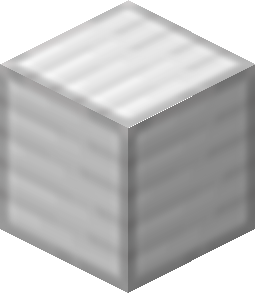</td><td>강인한 정신</td><td>체력이 50% 이하일 때 받는 피해가 15% 감소합니다.</td></tr>
<tr><td align="center"></td><td>개복치</td><td>최대체력이 절반 감소합니다. 적을 때릴 때마다 10% 확률로 능력을 이전 시킵니다.</td></tr>
<tr><td align="center"></td><td>경정권</td><td>공격 시 80%의 피해를 준 뒤 0.5초 후 40%의 피해와 2배의 넉백을 추가로 줍니다.</td></tr>
<tr><td align="center"></td><td>그랩</td><td>원거리 공격이 적에게 명중하면 그 적을 자신의 위치로 끌어옵니다.</td></tr>
<tr><td align="center"></td><td>냉혈한</td><td>적을 우클릭하면 해당 대상에게 구속과 나약함을 3초간 부여합니다.</td></tr>
<tr><td align="center">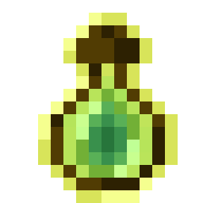</td><td>능력치</td><td>능력치 모루 2개를 획득합니다!</td></tr>
<tr><td align="center"></td><td>데드풀</td><td>최대 체력이 5칸으로 고정되며 1초마다 즉시 치유 I를 받습니다.</td></tr>
<tr><td align="center"></td><td>도박사</td><td>매 틱마다 1~239 사이의 무작위 숫자를 액션바에 표시합니다. 77이 나오면 최대 체력의 50%를 회복합니다.</td></tr>
<tr><td align="center">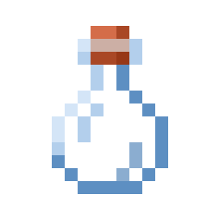</td><td>도주</td><td>체력이 35% 이하가 되면 신속 효과를 얻습니다.</td></tr>
<tr><td align="center"></td><td>동귀어진</td><td>자신을 죽인 적에게 3칸의 고정 피해를 줍니다.</td></tr>
<tr><td align="center"></td><td>매혹</td><td>공격한 상대에게 3초간 이동 속도를 50% 감소시키고 자신을 계속 바라보게 만듭니다.</td></tr>
<tr><td align="center"></td><td>모방</td><td>적을 죽일 시 적의 증강 중 하나를 복사합니다. 3회 복사 후 이 증강이 사라집니다.</td></tr>
<tr><td align="center"></td><td>반발</td><td>체력이 20% 이하로 내려가면 주변 적들을 밀쳐냅니다.</td></tr>
<tr><td align="center">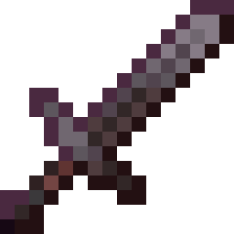</td><td>발도</td><td>공격 속도가 30% 증가합니다.</td></tr>
<tr><td align="center"></td><td>뱀파이어</td><td>근접 공격 시 입힌 피해의 10%만큼 체력을 회복합니다.</td></tr>
<tr><td align="center"></td><td>변태</td><td>적을 때릴 때마다 3% 확률로 갑옷 부위를 벗깁니다.</td></tr>
<tr><td align="center"></td><td>보너스</td><td>골드를 2배로 획득합니다.</td></tr>
<tr><td align="center"></td><td>보디가드</td><td>(8칸 이내의 팀원 수 x 5)%만큼 받는 피해를 감소시킵니다.</td></tr>
<tr><td align="center"></td><td>부기우기</td><td>양손 맞바꾸기 키로 20블록 내의 가장 가까운 적과 위치를 교환합니다.</td></tr>
<tr><td align="center"></td><td>불괴</td><td>아이템의 내구도가 소모될 때 75% 확률로 소모되지 않습니다.</td></tr>
<tr><td align="center"></td><td>불멸</td><td>사망 시 35%의 확률로 부활합니다. 부활 시 전체 체력의 절반인 상태로 부활하며 죽은 위치의 10칸 이내에 랜덤한 좌표에서 부활합니다.</td></tr>
<tr><td align="center"></td><td>붕뜨네</td><td>검 우클릭 시 바라보는 방향으로 돌풍구를 날립니다.</td></tr>
<tr><td align="center"></td><td>신체 폭탄</td><td>버리기 키를 누르면 체력 3칸을 소모하고 TNT를 던집니다.</td></tr>
<tr><td align="center">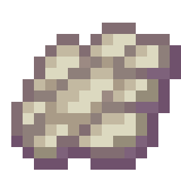</td><td>암살자</td><td>이동 속도가 60% 증가합니다. 피해를 받으면 6초간 비활성화됩니다.</td></tr>
<tr><td align="center">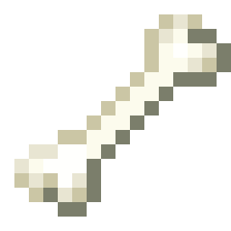</td><td>옥견</td><td>두 마리의 길들인 늑대가 당신을 도와 싸웁니다. 늑대는 사망 시 60초 후에 부활합니다.</td></tr>
<tr><td align="center">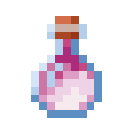</td><td>용린</td><td>4번째 공격마다 상대에게 불을 붙입니다.</td></tr>
<tr><td align="center">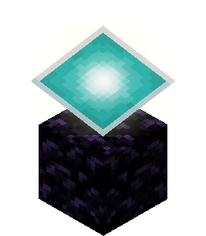</td><td>원기옥</td><td>10초 동안 피해를 받지 않으면 다음 공격이 치명타가 됩니다.</td></tr>
<tr><td align="center"></td><td>육중한 힘</td><td>공격력이 20% 증가합니다.</td></tr>
<tr><td align="center"></td><td>자폭</td><td>35초마다 머리 위에 TNT가 부착됩니다. 부착 시 5초 간 신속을 받은 뒤 폭발하며 반경 8칸 내 적에게 최대 체력의 20%로 고정 피해를 줍니다. 자신은 그 피해의 50%만 받습니다. 폭탄 보유 중 사망하면 즉시 폭발합니다.</td></tr>
<tr><td align="center"></td><td>저격 대결</td><td>12칸 이상 거리의 적을 공격 시 피해가 50% 증가합니다.</td></tr>
<tr><td align="center">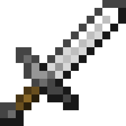</td><td>전 집중 호흡</td><td>부숴지지 않는 철 검을 지급합니다. 날카로움, 밀치기, 화염 부여, 휩쓸기 베기 중 각각 25% 확률로 무작위 레벨이 부여되며 적을 처치하거나 사망할 때마다 다시 부여됩니다.</td></tr>
<tr><td align="center">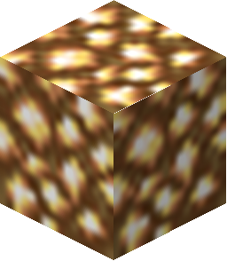</td><td>점멸</td><td>양손 맞바꾸기 키로 7칸 앞으로 빠르게 이동합니다. 벽은 투과할 수 없습니다.</td></tr>
<tr><td align="center"></td><td>죄책감의 쾌락</td><td>적 플레이어를 처치 시 최대 체력의 20%를 회복합니다.</td></tr>
<tr><td align="center"></td><td>주님의 사랑</td><td>검 우클릭 시 바라보는 방향으로 화염구를 3회 연달아 날립니다.</td></tr>
<tr><td align="center">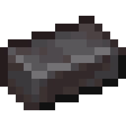</td><td>질량은 곧 힘</td><td>근접 공격 시 자신의 최대 체력의 5%에 해당하는 추가 피해를 입힙니다.</td></tr>
<tr><td align="center"></td><td>추가 체력</td><td>최대 체력 5칸을 늘립니다.</td></tr>
<tr><td align="center"></td><td>클린업</td><td>체력 30% 이하인 적이 10칸 내에 있으면 이동 속도가 30% 증가합니다.</td></tr>
<tr><td align="center"></td><td>포화지방산</td><td>배고픔이 소모되지 않습니다. 음식을 먹을 때마다 즉시 치유 효과를 받습니다.</td></tr>
<tr><td align="center"></td><td>흑섬</td><td>공격마다 3% 확률로 2.5배의 피해를 줍니다. 발동 후 3번의 공격 동안 확률이 증가합니다.</td></tr>
</tbody>
</table>

프리즘 증강 목록 (10종)

<table>
<thead>
<tr><th width="17%"></th><th width="33%">이름</th><th width="50%">설명</th></tr>
</thead>
<tbody>
<tr><td align="center">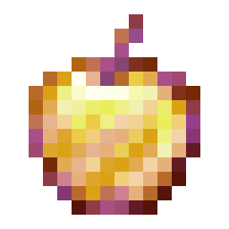</td><td>나노 테크놀로지</td><td>적 처치 시 적의 최대 체력 절반만큼 흡수 체력을 중첩하여 얻습니다.</td></tr>
<tr><td align="center"></td><td>능력치 더하기 더하기 더하기</td><td>능력치 모루 4개를 획득합니다!</td></tr>
<tr><td align="center"></td><td>드롭킥</td><td>근접 공격 시 체력 15% 이하인 적을 즉사시킵니다. 즉사한 적에게 강한 넉백과 폭발이 발생하며, 자신의 체력을 최대 체력의 50% 회복합니다.</td></tr>
<tr><td align="center"></td><td>무한한 골드</td><td>골드를 32767로 변경합니다. 단, 부활 시간이 5배 증가하며 주는 피해량이 10% 감소합니다.</td></tr>
<tr><td align="center">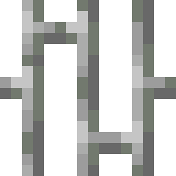</td><td>봉인</td><td>아이템을 우클릭하면 주변 10칸의 플레이어에게 9초간 몰수 효과를 부여합니다. 몰수: 모든 증강 사용이 금지되며 공격력이 10% 감소합니다.</td></tr>
<tr><td align="center"></td><td>유리 대포</td><td>최대 체력이 30% 감소합니다. 공격 시 15%의 추가 고정 피해를 입힙니다.</td></tr>
<tr><td align="center"></td><td>이지스</td><td>아이템을 우클릭하면 4초간 모든 피해를 무시하는 무적 상태가 됩니다.</td></tr>
<tr><td align="center"></td><td>처형인의 검</td><td>내구도가 1이지만 높은 날카로움 수치를 가진 금 검을 즉시 지급합니다. 검이 깨지면 자동으로 다시 지급됩니다.</td></tr>
<tr><td align="center"></td><td>탭 댄서</td><td>기본 공격 시 무한히 중첩되는 0.02의 이동 속도를 얻습니다. 마지막 중첩을 쌓은 후 5초 이내로 중첩을 쌓지 않으면 중첩이 빠르게 감소합니다.</td></tr>
<tr><td align="center">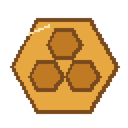</td><td>필연적인 존재</td><td>적을 처치할 때마다 50% 확률로 6종의 스톤 중 하나를 무작위로 획득합니다. 모두 모은 뒤 건틀릿을 우클릭하면 1회에 한해 모든 적을 즉사시키고 모든 스톤이 소멸합니다. 각 스톤은 왼손에 들고 있을 때 효과가 발동합니다.</td></tr>
</tbody>
</table>

